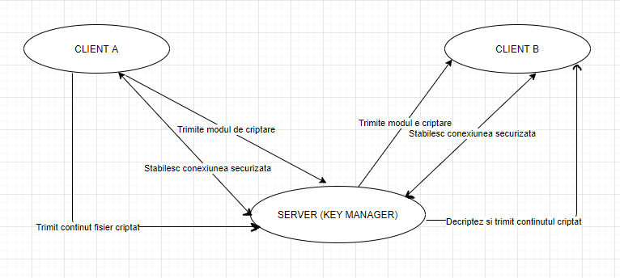
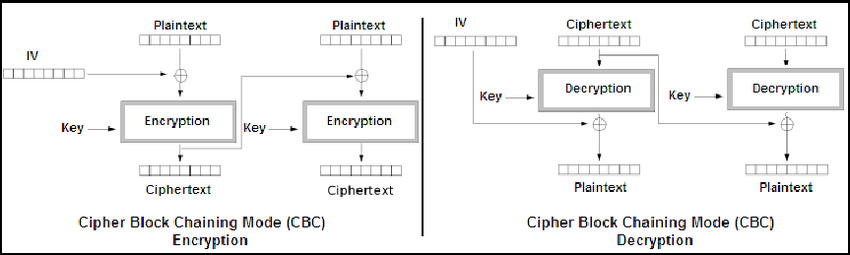
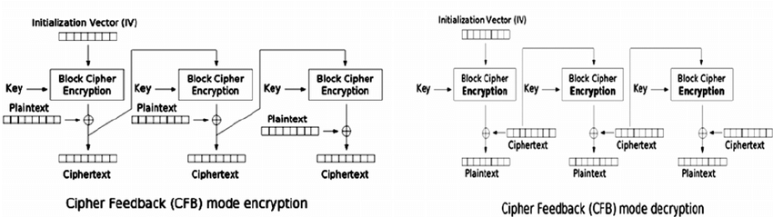

# Tema 1 - Securitatea informatiei

## Structura aplicatiei

Am creat o aplicatie client/server in limbajul python care rezolva problema comunicarii securizate intre clienti si managerul de chei.
Aplicatia utilizeaza doua moduri de criptare, AES CBC si AES CFB, dar implementate intr-un mod explicit in care este vizibila impartirea in blocuri de dimensiune fixa, aplicare unui padding la blocurile de dimensiune insuficienta, precum si realizarea de operatii explicite de xor.
Functionalitatea aplicatiei este prezentata mai in detaliu in diagrama de mai jos!
 

 
## Criptarea/Decriptarea datelor 

Am implementat si utilizat in mod explicit algoritmii de AES CBC si AES CFB, am efectuat spargerea in blocuri si xor ul, iar partea de criptare, fie a rezultatului xor ului, la cbc, fie a vectorul de initializare, la cfb, a fost efectuata folosind un obiect de tipul AES.new(key, AES.MODE_CFB, iv), respectiv AES.new(key, AES.MODE_CBC, Encryptor.block_iv).

Criptarea si decriptarea a fost realizata astfel:
 

 

 

## Librarii folosite
 
Pe parcursul utilizarii aplicatiei am utilizat librariile:
1. **socket**: pentru comunicarea in retea, dintre client/server
2. **pickle**: pentru serializarea datelor in binar si trimiterea lor ca un obiect mai complex prin socket pentru a evita conflictele la folosirea de sendall/recv consecutive.
3. **os.path**: pentru a verifica existenta unui fisier pe disc in momentul cand clientul a incarca si trimite fisierul catre server
4. **Crypto.Cipher**: pentru a utiliza suita de algoritmi de criptare a limbaului python
5. **random**: pentru a genera date random in functie de nevoile aplicatiei

## Lansare aplicatie
Pentru lansarea aplicatiei aveti nevoie sa aveti instalat interpretorul python si un text editor.
Inainte de executia aplicatiei, deschideti **in linia de comanda** directorul unde ati descarcat fisierele si instalati **manual** libraria
Crypto.Cipher utilizand comanda: **pip3 install pycryptodome**. In cazul in care intampinati eroarea **ImportError: No module named Crypto.Cipher**, [Click aici](https://stackoverflow.com/questions/19623267/importerror-no-module-named-crypto-cipher).

Lansati, **in aceasta ordine** fisierele: server.py, client_a.py, client_b.py, si urmati instructiunile afisate de catre aceste script-uri.